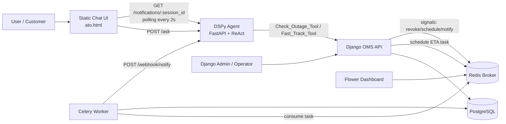
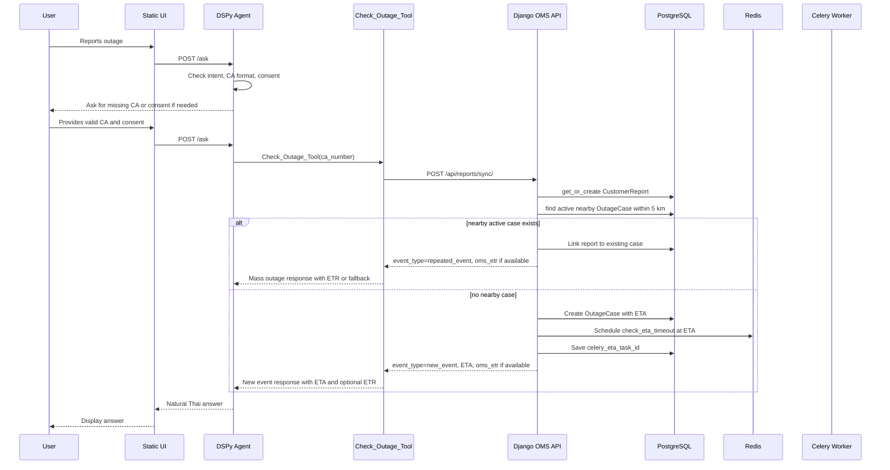
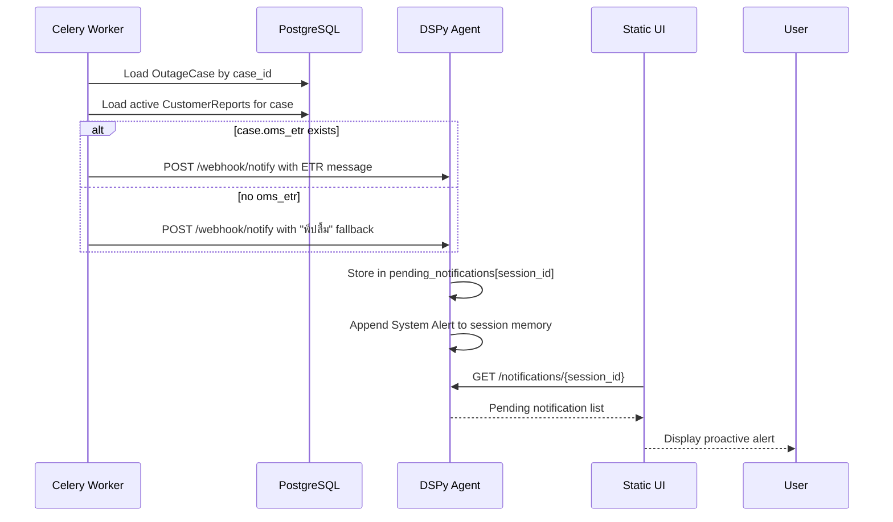
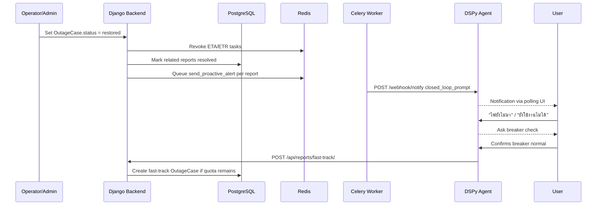

# PEA OMS System Architecture

เอกสารนี้อธิบาย architecture ของระบบใน repository นี้ตาม implementation ปัจจุบัน
โดยครอบคลุม frontend demo, DSPy agent, Django OMS backend, PostgreSQL, Redis,
Celery worker, Django Admin และ proactive notification flow

สถานะเอกสาร: 2026-06-25

## 1. High-Level Overview

ระบบนี้เป็น prototype สำหรับรับเรื่องแจ้งไฟดับผ่าน chat interface แล้วให้ AI Agent
ช่วยตรวจสอบ/เปิดใบงานใน OMS mock backend พร้อมกลไก ETA, ETR, proactive alert
และ closed-loop handling

แนวคิดหลักของระบบคือ:

1. ผู้ใช้คุยกับหน้าเว็บ chat demo
2. หน้าเว็บส่งคำถามไปที่ DSPy Agent
3. DSPy Agent คุม conversation flow, ตรวจ intent, ตรวจ CA, ขอ consent และเรียก tool
4. Tool ยิง Django API เพื่อ sync report และสร้าง/ผูก outage case
5. Django backend เก็บข้อมูลใน PostgreSQL และตั้งเวลา ETA timeout ผ่าน Celery
6. Celery worker ยิง proactive webhook กลับไปที่ DSPy Agent เมื่อถึงเวลา ETA หรือเกิด event สำคัญ
7. หน้าเว็บ polling `/notifications/{session_id}` เพื่อดึง notification ไปแสดง
8. เจ้าหน้าที่ใช้ Django Admin ปรับ status, ETA, ETR และปิดเคส



## 2. Runtime Services

Services are defined in `docker-compose.yml`.

| Service | Container | Port | Responsibility |
| --- | --- | --- | --- |
| `backend` | `backend` | `8000:8000` | Django REST API, Django Admin, ORM, migrations |
| `dspy-agent` | `dspy-agent` | `8001:8000` | FastAPI server, DSPy ReAct agent, in-memory session state, notification buffer |
| `celery_worker` | `celery_worker` | internal | Runs ETA timeout and proactive alert tasks |
| `redis` | `redis` | `6379:6379` | Celery broker |
| `db` | `postgres` | `5432:5432` | PostgreSQL database |
| `flower` | `celery_flower` | `5555:5555` | Celery monitoring UI |

## 3. Major Components

### 3.1 Static Chat UI

File: `ato.html`

Responsibilities:

- Creates or reuses a browser-local `session_id`
- Sends user messages to `POST /ask`
- Displays agent answer and returned state
- Polls `GET /notifications/{session_id}` every 2 seconds
- Shows proactive notifications returned by the DSPy Agent

Current implementation note:

- This is a browser polling simulation, not a real push channel.
- In production, `/webhook/notify` would typically push to LINE/Facebook/WebSocket instead of relying on polling.
- `API_URL` and `NOTIFICATIONS_URL` are currently hardcoded in the HTML and should be changed per deployment environment.

### 3.2 DSPy Agent Service

Main files:

- `dspy/webhook_server.py`
- `dspy/agent.py`
- `dspy/signature.py`
- `dspy/tools.py`

Responsibilities:

- Exposes FastAPI endpoints:
  - `POST /ask`
  - `POST /webhook/notify`
  - `GET /notifications/{session_id}`
  - `GET /health`
- Holds per-session chat history in memory
- Holds per-session consent state in memory
- Runs DSPy ReAct agent with:
  - `Check_Outage_Tool`
  - `Fast_Track_Tool`
- Buffers proactive notifications in `pending_notifications`
- Injects proactive OMS alerts back into session memory as `System Alert (OMS)`

Important behavior:

- CA number must be exactly 12 digits.
- `Check_Outage_Tool` must not proceed unless user has consented.
- Tool-level guard protects the API even if the LLM attempts to call the tool too early.
- `pending_notifications` and conversation memory are process memory only. They are lost when `dspy-agent` restarts.

### 3.3 Django OMS Backend

Main files:

- `backend/oms/views_api.py`
- `backend/oms/serializers.py`
- `backend/oms/models.py`
- `backend/oms/tasks.py`
- `backend/oms/signals.py`
- `backend/oms/admin.py`

Responsibilities:

- Validates incoming agent reports
- Stores customer reports and outage cases
- Matches new reports to active nearby cases within 5 km
- Creates new outage cases when no nearby active case exists
- Sets ETA for newly created cases
- Returns OMS ETR if an operator has filled it in
- Schedules ETA timeout tasks through Celery
- Sends proactive notifications through Celery tasks
- Supports admin-driven ETA/ETR/status updates

### 3.4 PostgreSQL

Stores durable business data:

- `OutageCase`
- `CustomerReport`
- Django auth/admin/session tables

Chat history in the current agent is not stored in PostgreSQL by the DSPy service.
`CustomerReport.chat_history` exists in the model but is not currently the source of truth for agent memory.

### 3.5 Redis + Celery

Redis is used as the Celery broker.

Celery worker runs:

- `oms.tasks.check_eta_timeout`
- `oms.tasks.send_proactive_alert`

ETA timeout tasks are scheduled with `apply_async(..., eta=eta_target_time)`.

## 4. Data Model

### 4.1 OutageCase

Represents an OMS outage case.

| Field | Meaning |
| --- | --- |
| `case_id` | UUID primary key |
| `title` | Case title |
| `status` | `reported`, `investigating`, `repairing`, `restored` |
| `latitude`, `longitude` | Case location |
| `eta_target_time` | ETA for technician arrival |
| `oms_etr` | ETR filled by operator/admin or external OMS |
| `celery_eta_task_id` | Scheduled Celery ETA timeout task id |
| `celery_etr_task_id` | Reserved for ETR timer/task id |
| `created_at`, `updated_at` | Timestamps |

### 4.2 CustomerReport

Represents a customer/session report.

| Field | Meaning |
| --- | --- |
| `session_id` | Frontend/user session id |
| `ca_number` | Customer account number, currently exactly 12 digits |
| `latitude`, `longitude` | Customer/report location |
| `related_case` | Linked `OutageCase` |
| `chat_history` | Persisted field exists, but current DSPy memory is in-process |
| `needs_eta`, `needs_etr` | Intent flags, currently not the main decision source |
| `is_resolved` | Whether this report/session is resolved |
| `fast_track_quota` | Anti-loop quota for repeated outage after closure |
| `time_stamp` | Agent-supplied timestamp |

## 5. API Surface

### 5.1 DSPy Agent API

| Method | Path | Caller | Purpose |
| --- | --- | --- | --- |
| `POST` | `/ask` | Static UI | Ask the agent a question |
| `POST` | `/webhook/notify` | Django/Celery | Push proactive OMS alert into agent/session memory |
| `GET` | `/notifications/{session_id}` | Static UI | Poll pending notifications for a session |
| `GET` | `/health` | Infra/dev | Health check |

### 5.2 Django OMS API

| Method | Path | Caller | Purpose |
| --- | --- | --- | --- |
| `POST` | `/api/reports/sync/` | `Check_Outage_Tool` | Create/update report, link/create case, return ETA/ETR |
| `GET` | `/api/reports/status/?ca_number=...` | Tool/future clients | Read active case status by CA |
| `POST` | `/api/reports/fast-track/` | `Fast_Track_Tool` | Create urgent repeat outage ticket |

### 5.3 Django Admin

Path: `/admin/`

Used by operator to:

- View cases
- Edit ETA
- Fill OMS ETR
- Change status
- Close case by setting status to `restored`

## 6. CA Validation and Consent Gate

### 6.1 CA Validation

CA number must match:

```text
^\d{12}$
```

Validation exists in two places:

1. Django serializer/API layer:
   - `AgentReportSerializer`
   - `ActionStatusRequestSerializer`
   - `fast_track_report`
2. DSPy tool layer:
   - `Check_Outage_Tool`
   - `Fast_Track_Tool`

If invalid, tool returns:

```text
[CA_INVALID]
```

### 6.2 Consent Before Check_Outage_Tool

Before using `Check_Outage_Tool`, the agent must ask for permission to check outage data using the CA number.

The current consent state is stored per `session_id` inside `MemoryAgent`.

If consent has not been granted, tool returns:

```text
[CONSENT_REQUIRED]
```

This provides a second layer of protection in case the LLM tries to call the tool before the flow allows it.

Current limitation:

- Consent state is in memory only.
- Restarting `dspy-agent` clears consent and chat history.

## 7. Core User Flow: New Outage Report



Behavior:

- New case gets ETA automatically.
- New case does not automatically get ETR.
- ETR is returned only if `oms_etr` already exists on the related case.
- If new event has no ETR, agent should provide ETA only.

## 8. ETR Handling

ETR source:

- `OutageCase.oms_etr`
- Entered by operator through Django Admin or future external OMS integration

Rules:

1. During `new_event`
   - If `oms_etr` exists, return ETA + ETR
   - If `oms_etr` is missing, return ETA only
2. During mass/repeated event
   - If `oms_etr` exists, return ETR
   - If missing, return fallback to ETR model "พี่ปลื้ม"
3. During ETA timeout
   - If `oms_etr` exists, proactive notification includes ETR
   - If missing, proactive notification says the system is connecting to "พี่ปลื้ม"

## 9. ETA Timeout and Proactive Notification Flow

When a case is created, Django schedules `check_eta_timeout(case_id, report_id)` at `eta_target_time`.

Current behavior:

- At timeout, Celery loads the `OutageCase`
- If case status is still `reported` or `investigating`, it sends notification
- Notification is sent to every active `CustomerReport` linked to that case
- It excludes resolved reports
- It skips empty/null `session_id`
- It sends only once per unique `session_id`



Important note:

- `dspy-agent` is not continuously pushing messages by itself.
- The browser polls `/notifications/{session_id}` every 2 seconds.
- Real push integration should replace this with LINE/Facebook/WebSocket push in production.

## 10. Admin-Driven Updates and Signals

Signals are defined in `backend/oms/signals.py`.

### 10.1 ETA Change

When operator changes `eta_target_time`:

1. `pre_save` compares old ETA and new ETA
2. Existing `celery_eta_task_id` is revoked
3. `_needs_new_eta_task` is set
4. `post_save` schedules a new ETA timeout task
5. New task id is saved to `celery_eta_task_id`

### 10.2 Case Restored

When operator changes status to `restored`:

1. Existing ETA/ETR tasks are revoked
2. Task ids are cleared
3. All active related `CustomerReport` records are marked `is_resolved=True`
4. `send_proactive_alert` is queued for each affected customer
5. Agent receives `event_type=closed_loop_prompt`
6. If user says power is still not back, agent asks breaker-check question
7. If breaker is normal, `Fast_Track_Tool` creates an urgent repeat ticket



## 11. Event Types

| Event Type | Produced By | Meaning |
| --- | --- | --- |
| `new_event` | Django `/reports/sync/` | New outage case created |
| `repeated_event` | Django `/reports/sync/` | Report matched existing active nearby case |
| `eta_timeout` | Celery `check_eta_timeout` | Technician ETA expired while case is not progressed |
| `closed_loop_prompt` | Celery `send_proactive_alert` after restored | System says power is restored; user can confirm if still out |
| `fast_track_created` | Django `/reports/fast-track/` | Urgent repeat ticket created |
| `fallback_to_human` | Django `/reports/fast-track/` or tool fallback | User should be transferred to human agent |

## 12. Operational Commands

Start services:

```bash
docker compose up -d --build
```

Restart services after code changes:

```bash
docker compose restart backend dspy-agent celery_worker
```

Inspect Celery worker state:

```bash
docker compose exec celery_worker celery -A pea_project inspect active
docker compose exec celery_worker celery -A pea_project inspect scheduled
docker compose exec celery_worker celery -A pea_project inspect reserved
```

Revoke one Celery task:

```bash
docker compose exec celery_worker celery -A pea_project control revoke <task_id>
```

Revoke a running task:

```bash
docker compose exec celery_worker celery -A pea_project control revoke <task_id> --terminate
```

Purge queued Celery tasks:

```bash
docker compose exec celery_worker celery -A pea_project purge -f
```

Stop optional services:

```bash
docker compose stop flower
```

Stop ETA/proactive worker:

```bash
docker compose stop celery_worker
```

Run backend tests:

```bash
docker compose exec backend python manage.py test oms
```

Check DSPy Python syntax:

```bash
docker compose exec dspy-agent python -m py_compile agent.py signature.py tools.py
```

## 13. Current Limitations and Production Notes

1. Agent memory is in-process
   - Restarting `dspy-agent` clears chat history, consent state, and pending notifications.
   - Production should use Redis/PostgreSQL/session store.

2. Notification delivery is polling-based
   - Browser polls every 2 seconds.
   - Production should push to LINE/Facebook/WebSocket or a real notification service.

3. ETR is manual/admin-driven
   - `oms_etr` is only available after operator fills it in.
   - Future OMS integration can update `OutageCase.oms_etr` automatically.

4. Location matching is mock/simple
   - CA number maps to mock coordinates in `dspy/tools.py`.
   - Django matches active cases within 5 km by simple distance calculation.
   - Production should use real customer/asset GIS data.

5. Static UI has hardcoded endpoint URLs
   - `ato.html` should be parameterized or generated per environment.

6. Celery scheduled ETA tasks depend on worker/broker state
   - Restart/revoke behavior should be monitored via Flower or Celery inspect commands.

7. Security settings are development-oriented
   - `DEBUG=True`, permissive CORS, and `ALLOWED_HOSTS=['*']` are suitable only for demo/dev.

## 14. Source File Map

| Concern | File |
| --- | --- |
| Static chat UI | `ato.html` |
| Agent FastAPI server | `dspy/webhook_server.py` |
| Agent memory/session wrapper | `dspy/agent.py` |
| Agent prompt/signature | `dspy/signature.py` |
| Agent tools | `dspy/tools.py` |
| Django API routes | `backend/oms/router.py` |
| Django API handlers | `backend/oms/views_api.py` |
| Serializers/validation | `backend/oms/serializers.py` |
| Data models | `backend/oms/models.py` |
| Admin UI | `backend/oms/admin.py` |
| Celery tasks | `backend/oms/tasks.py` |
| Django signals | `backend/oms/signals.py` |
| Celery app config | `backend/pea_project/celery.py` |
| Django settings | `backend/pea_project/settings.py` |
| Runtime composition | `docker-compose.yml` |
