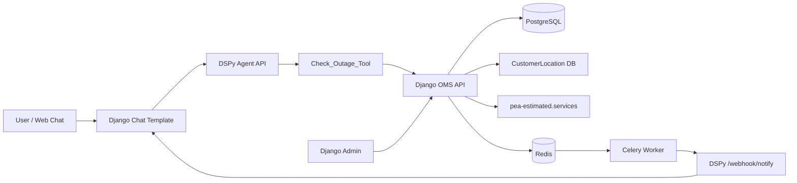
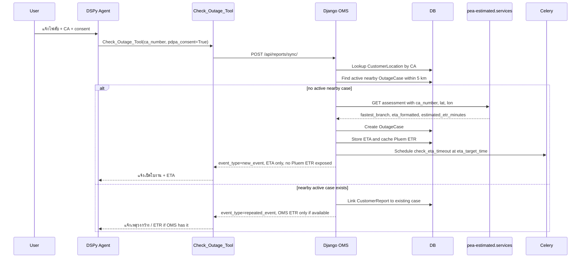
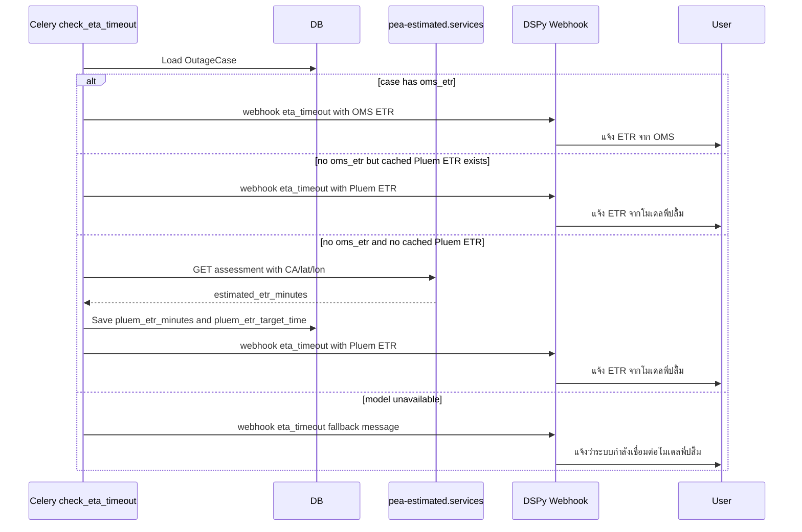

# PEA OMS Agent System Architecture

เอกสารนี้สรุปภาพรวมระบบ PEA OMS Agent แบบอ่านง่าย พร้อมตัวอย่าง expected conversation สำหรับ scenario สำคัญที่ใช้ทดสอบ flow ปัจจุบัน

## 1. Big Picture

ระบบนี้มีหน้าที่รับแจ้งไฟฟ้าขัดข้องจากผู้ใช้ผ่านหน้าแชท แล้วให้ Agent ช่วยคุยกับลูกค้าแบบมี guardrail ก่อนส่งข้อมูลเข้า Django OMS

หลักการสำคัญ:

- Agent ไม่ตัดสิน outage เอง
- Agent ต้องขอ consent ก่อนใช้ `Check_Outage_Tool`
- CA ต้องเป็นตัวเลขล้วน 12 หลักเท่านั้น
- Django OMS เป็นเจ้าของข้อมูล case, customer, ETA, ETR, webhook, countdown
- `pea-estimated.services` ใช้ประเมิน branch, ETA, และ ETR model
- ตอนเปิดเคสใหม่ แจ้งเฉพาะ ETA ก่อน
- ETR จาก OMS แจ้งได้ทันทีถ้ามี
- ETR จากโมเดลพี่ปลื้มแจ้งผ่าน webhook หลัง ETA timeout เท่านั้น ถ้า OMS ยังไม่มี ETR

## 2. Components



## 3. Service Roles

| Service | Role |
|---|---|
| `backend` | Django API, Django Admin, chat page, OMS models |
| `dspy-agent` | Agent reasoning, tool selection, webhook receiver |
| `db` | PostgreSQL data store |
| `redis` | Celery broker |
| `celery_worker` | ETA timeout task and proactive notifications |
| `flower` | Celery monitoring |
| `pea-estimated.services` | External ETA/ETR assessment service |

## 4. Main Data Models

### `CustomerLocation`

Imported from `ca_lat_lon.csv`.

Stores:

- `ca_number`
- `fullname`
- `address`
- `phone_number`
- `latitude`
- `longitude`
- CSV metadata

Purpose:

- Replace old CA coordinate mock
- Allow backend to map CA to lat/lon before creating or matching outage cases

### `CustomerReport`

One report/session from a user.

Stores:

- `session_id`
- `ca_number`
- `customer_name`
- `latitude`
- `longitude`
- `related_case`
- `pdpa_consent`
- `pdpa_consent_at`
- `fast_track_quota`
- `is_resolved`

Purpose:

- Track each user/session
- Allow one outage case to notify all related active sessions

### `OutageCase`

Actual OMS outage case.

Stores:

- `case_id`
- `status`
- `latitude`
- `longitude`
- `eta_target_time`
- `oms_etr`
- `assessment_fastest_branch`
- `assessment_eta_formatted`
- `assessment_eta_minutes`
- `pluem_etr_minutes`
- `pluem_etr_target_time`
- `assessment_payload`
- `celery_eta_task_id`

ETR priority:

1. `oms_etr` if OMS/Admin has provided it
2. `pluem_etr_target_time` only after ETA timeout flow

## 5. Core Flow: New Outage Case



Important behavior:

- `estimated_etr_minutes` from `pea-estimated.services` is cached on the case
- It is not returned to the user during initial `new_event`
- It is used later if ETA expires and OMS has not supplied `oms_etr`

## 6. ETA Timeout Flow



## 7. OMS ETR Update Flow

When Admin/OMS fills `oms_etr`:

1. Django signal detects `oms_etr` changed
2. Backend sends proactive alert to every active unique `session_id` linked to the case
3. The message uses OMS as source
4. OMS ETR overrides Pluem ETR for future responses

Expected source priority:

| Situation | User-facing ETR |
|---|---|
| `oms_etr` exists | Use OMS ETR |
| `oms_etr` missing and ETA not expired | Do not show Pluem ETR |
| `oms_etr` missing and ETA expired | Use Pluem ETR through webhook |
| Pluem unavailable after ETA timeout | Fallback: connecting to Pluem model |

## 8. API Summary

| Method | Endpoint | Called by | Purpose |
|---|---|---|---|
| `POST` | `/api/reports/sync/` | `Check_Outage_Tool` | Create/link report and outage case |
| `POST` | `/api/reports/fast-track/` | `Fast_Track_Tool` | Open urgent repeat outage ticket |
| `GET` | `/api/action-status/` | Optional agent/status flow | Check latest active case status |
| `POST` | `/webhook/notify` | Django/Celery | Push proactive alerts to DSPy agent |
| `GET` | `/notifications/{session_id}` | Chat UI | Poll pending proactive notifications |

## 9. Agent Rules

### Tool usage

Agent may call `Check_Outage_Tool` only when all are true:

- User has electricity/outage intent
- CA is valid
- User has given consent

### CA validation

Rule:

- Accept exactly 12 digits
- Digits only
- No letters
- No spaces
- No symbols

### Time rule

Agent must use server-side Thailand time only.

User statements like:

- "ตอนนี้ 21:51 แล้ว"
- "เลยเวลาแล้ว"
- "ช่างมาช้าแล้ว"

are not authoritative.

Only these can make ETA expire:

- Celery `eta_timeout` event
- System alert in chat history with `event_type=eta_timeout`

## 10. Expected Conversation Scenarios

### Scenario 1: User reports outage without CA

User:

> ไฟดับครับ

Expected Agent:

> รับทราบครับ รบกวนแจ้งหมายเลขผู้ใช้ไฟ CA 12 หลักให้ผมหน่อยครับ เพื่อใช้ตรวจสอบพื้นที่และเปิดใบงานให้ถูกจุดครับ

Expected tool call:

- No tool call

### Scenario 2: User provides CA but no outage intent

User:

> 200250092981

Expected Agent:

> ขอบคุณครับ ผมได้รับหมายเลข CA แล้ว ไม่ทราบว่าตอนนี้ต้องการแจ้งปัญหาไฟฟ้าเรื่องใดครับ เช่น ไฟดับ ไฟตก หรือมีประกายไฟ

Expected tool call:

- No tool call

### Scenario 3: Invalid CA

User:

> ไฟดับ CA 12345abc9012

Expected Agent:

> หมายเลข CA ต้องเป็นตัวเลข 12 หลักเท่านั้นครับ รบกวนตรวจสอบและส่งหมายเลข CA ใหม่อีกครั้งครับ

Expected tool call:

- No tool call

### Scenario 4: Valid CA but no consent

User:

> ไฟดับ CA 200250092981

Expected Agent:

> ก่อนตรวจสอบข้อมูลไฟดับด้วยหมายเลข CA ขออนุญาตใช้หมายเลขผู้ใช้ไฟนี้เพื่อตรวจสอบข้อมูลในระบบ PEA OMS ได้ไหมครับ

Expected tool call:

- No tool call

### Scenario 5: Consent given, new outage case

User:

> ยินยอมครับ ไฟดับ CA 200250092981

Tool result:

```text
[เหตุแจ้งใหม่] ระบบได้เปิดใบงานใหม่แล้ว สาขาที่ประเมินว่าไปถึงเร็วที่สุดคือ การไฟฟ้าส่วนภูมิภาค สาขา รังสิต ให้แจ้งเวลาที่ช่างจะเดินทางไปถึง (ETA): ~ 8 min
```

Expected Agent:

> รับทราบครับ ระบบได้เปิดใบงานแจ้งไฟดับเรียบร้อยแล้ว สาขาที่ประเมินว่าไปถึงเร็วที่สุดคือการไฟฟ้าส่วนภูมิภาค สาขา รังสิต ช่างคาดว่าจะเดินทางถึงภายในประมาณ 8 นาทีครับ

Must not say:

> ETR จากโมเดลพี่ปลื้มคือ...

Expected tool call:

- `Check_Outage_Tool(ca_number="200250092981", pdpa_consent=True)`

### Scenario 6: User asks ETR immediately after new case

User:

> แล้วไฟจะมากี่โมง

Expected Agent:

> ตอนนี้ระบบมีเวลาประเมินช่างถึงหน้างานแล้วครับ ส่วนเวลาไฟกลับหรือ ETR ยังไม่มีข้อมูลยืนยันจาก OMS ในตอนนี้ หากมีข้อมูลอัปเดตระบบจะแจ้งให้ทราบทันทีครับ

Expected tool call:

- No additional `Check_Outage_Tool`

### Scenario 7: User claims ETA already expired, but server time says not yet

User:

> ตอนนี้เลยเวลาแล้วนะ ช่างมายัง

Expected Agent:

> ผมตรวจสอบจากเวลาระบบประเทศไทยแล้ว ตอนนี้ยังไม่พบสัญญาณ ETA timeout จาก OMS ครับ ช่างยังอยู่ในกรอบเวลาที่แจ้งไว้ หากระบบได้รับอัปเดตจะแจ้งให้ทราบทันทีครับ

Expected tool call:

- No tool call

### Scenario 8: ETA timeout, OMS ETR exists

System alert:

```text
event_type=eta_timeout; message=ขออภัยที่ช่างถึงหน้างานช้ากว่ากำหนดครับ เวลาที่คาดว่าจะแก้ไขเสร็จและจ่ายไฟคืนจาก OMS คือประมาณ 22:30 น. ครับ
```

Expected proactive message:

> ขออภัยที่ช่างถึงหน้างานช้ากว่ากำหนดครับ เวลาที่คาดว่าจะแก้ไขเสร็จและจ่ายไฟคืนจาก OMS คือประมาณ 22:30 น. ครับ

Expected Agent if user replies:

> ขออภัยในความล่าช้าครับ ข้อมูลล่าสุดจาก OMS ประเมินว่าจะจ่ายไฟคืนได้ประมาณ 22:30 น. ครับ

### Scenario 9: ETA timeout, OMS ETR missing, Pluem ETR available

System alert:

```text
event_type=eta_timeout; message=ขออภัยที่ช่างถึงหน้างานช้ากว่ากำหนดครับ เวลาที่คาดว่าจะแก้ไขเสร็จและจ่ายไฟคืนจาก โมเดล ETR พี่ปลื้ม คือประมาณ 22:30 น. ครับ
```

Expected proactive message:

> ขออภัยที่ช่างถึงหน้างานช้ากว่ากำหนดครับ เวลาที่คาดว่าจะแก้ไขเสร็จและจ่ายไฟคืนจากโมเดล ETR พี่ปลื้มคือประมาณ 22:30 น. ครับ

Expected Agent if user replies:

> ขออภัยในความล่าช้าครับ ตอนนี้ยังไม่มี ETR จาก OMS โดยตรง ระบบจึงใช้ค่าประเมินจากโมเดล ETR พี่ปลื้ม ล่าสุดคาดว่าจะจ่ายไฟคืนประมาณ 22:30 น. ครับ

### Scenario 10: ETA timeout, OMS ETR missing, Pluem model unavailable

System alert:

```text
event_type=eta_timeout; message=ขออภัยที่ช่างถึงหน้างานช้ากว่ากำหนดครับ ขณะนี้ยังไม่มี ETR จาก OMS ระบบกำลังเชื่อมต่อกับโมเดล ETR พี่ปลื้มเพื่อประเมินเวลาไฟกลับมาใช้งานได้ครับ
```

Expected Agent:

> ขออภัยที่ล่าช้าครับ ขณะนี้ยังไม่มี ETR จาก OMS และระบบกำลังเชื่อมต่อโมเดล ETR พี่ปลื้มเพื่อประเมินเวลาไฟกลับมาใช้งานได้ครับ หากมีอัปเดตจะแจ้งให้ทราบทันทีครับ

### Scenario 11: Repeated/mass outage with OMS ETR

Tool result:

```text
[เหตุวงกว้าง] แจ้ง ETR จาก OMS: 2026-06-26T22:30:00+07:00 แก่ลูกค้า
```

Expected Agent:

> ตรวจพบว่าเหตุนี้เกี่ยวข้องกับเหตุไฟดับในพื้นที่เดียวกันครับ ข้อมูลจาก OMS ประเมินว่าจะจ่ายไฟคืนได้ประมาณ 22:30 น. ครับ

Expected tool call:

- `Check_Outage_Tool`

Must not say:

> ช่างจะถึงภายใน...

### Scenario 12: Repeated/mass outage without OMS ETR

Tool result:

```text
[เหตุวงกว้าง] กำลังเชื่อมต่อกับโมเดล ETR พี่ปลื้มครับ
```

Expected Agent:

> ตรวจพบว่าเหตุนี้เกี่ยวข้องกับเหตุไฟดับในพื้นที่เดียวกันครับ ตอนนี้ยังไม่มี ETR ยืนยันจาก OMS หากมีข้อมูลอัปเดตระบบจะแจ้งให้ทราบทันทีครับ

Expected tool call:

- `Check_Outage_Tool`

### Scenario 13: CA not found in customer location DB

Tool result:

```text
[CA_NOT_FOUND] ไม่พบหมายเลข CA นี้ในฐานข้อมูลพิกัดลูกค้า กรุณาตรวจสอบหมายเลข CA อีกครั้ง หรือโอนให้เจ้าหน้าที่ช่วยตรวจสอบ
```

Expected Agent:

> ผมยังไม่พบหมายเลข CA นี้ในฐานข้อมูลพิกัดลูกค้าครับ รบกวนตรวจสอบหมายเลขอีกครั้ง หากหมายเลขถูกต้องแล้วผมจะประสานให้เจ้าหน้าที่ช่วยตรวจสอบต่อครับ

### Scenario 14: Assessment service error

Tool result:

```text
[FallBack] ระบบประเมิน ETA/ETR ขัดข้อง ให้ตอบว่ากำลังโอนสายให้เจ้าหน้าที่
```

Expected Agent:

> ขออภัยครับ ระบบประเมินเวลาขณะนี้ขัดข้อง ผมจะส่งต่อให้เจ้าหน้าที่ช่วยตรวจสอบและดำเนินการต่อครับ

### Scenario 15: Out of scope

User:

> น้ำประปาไม่ไหลครับ

Expected Agent:

> ช่องทางนี้สำหรับแจ้งปัญหาไฟฟ้าของ PEA เป็นหลักครับ กรณีน้ำประปาไม่ไหล รบกวนติดต่อหน่วยงานประปาในพื้นที่โดยตรงนะครับ

Expected tool call:

- No tool call

### Scenario 16: User is frustrated after ETA

User:

> ช้ามาก ทำไมยังไม่มา

Expected Agent:

> ขออภัยในความไม่สะดวกจริงๆ ครับ ผมยึดตามข้อมูลล่าสุดจาก OMS เป็นหลัก ตอนนี้ยังไม่มีสัญญาณ ETA timeout หรือ ETR ใหม่เข้ามา หากระบบได้รับอัปเดตจะแจ้งให้ทราบทันทีครับ

Expected tool call:

- No repeated `Check_Outage_Tool`

### Scenario 17: Closed-loop restored but user says power still out

Precondition:

- Chat history contains `event_type=closed_loop_prompt`
- User says power is still out

User:

> ไฟยังไม่มา

Expected Agent:

> รบกวนตรวจสอบสวิตช์เบรกเกอร์เมนภายในบ้านว่าทริปหรือตกลงมาหรือไม่ครับ หากตรวจสอบแล้วปกติ กรุณาพิมพ์ว่า "ปกติ" เพื่อยืนยันให้ช่างเข้าตรวจสอบซ้ำครับ

Expected tool call:

- No `Fast_Track_Tool` yet

### Scenario 18: Breaker normal, create fast track

User:

> ปกติ เช็คแล้ว

Tool result:

```text
[Success] สร้างตั๋ว Fast-track สำเร็จ ให้ตอบลูกค้าว่าประสานงานด่วนแล้ว
```

Expected Agent:

> รับทราบครับ ผมสร้างใบงานตรวจสอบซ้ำแบบเร่งด่วนให้แล้ว เจ้าหน้าที่จะประสานช่างเข้าตรวจสอบอีกครั้งครับ

Expected tool call:

- `Fast_Track_Tool(ca_number)`

### Scenario 19: Fast track quota exhausted

Tool result:

```text
[FallBack] โควต้าแจ้งซ้ำหมดแล้ว ให้ตอบว่ากำลังโอนสายให้เจ้าหน้าที่ (Force Fallback)
```

Expected Agent:

> เคสนี้มีการตรวจสอบซ้ำครบโควต้าแล้วครับ ผมจะส่งต่อให้เจ้าหน้าที่รับช่วงตรวจสอบโดยตรงครับ

## 11. Developer Test Checklist

Use this checklist when testing the system:

- CA with 11 digits fails validation
- CA with 12 digits passes validation
- CA with letters/symbols fails validation
- Agent asks consent before calling `Check_Outage_Tool`
- New event returns ETA only
- New event does not mention Pluem ETR
- `oms_etr` update sends proactive webhook
- ETA timeout sends OMS ETR when available
- ETA timeout sends Pluem ETR when OMS ETR is missing
- ETA timeout notifies all active unique `session_id` values linked to the case
- User-claimed time does not cause ETA timeout
- Fast track only runs after closed-loop prompt and breaker confirmation

## 12. Current Known Temporary Rules

- CA validation accepts exactly 12 digits
- `CustomerLocation` comes from imported CSV
- `CustomerLocation.ca_number` is unique, duplicate CA rows are skipped during import
- Agent web chat polls pending proactive notifications from `dspy-agent`
- ETR from Pluem is model-estimated, not OMS-confirmed
