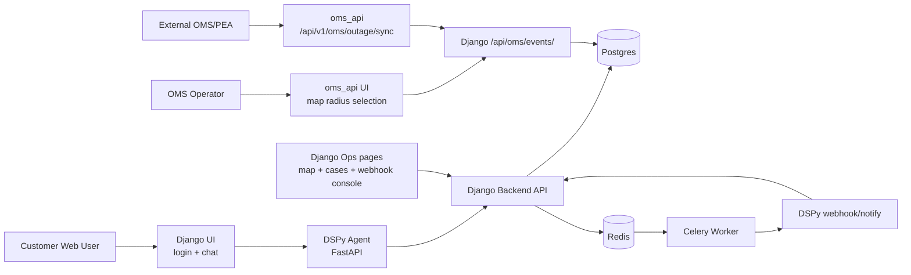

# System Architecture Overview

เอกสารนี้สรุปภาพรวมระบบ PEA OMS หลัง refactor ล่าสุด: Django เป็น source of truth ของเคสในระบบ chatbot/session/webhook ส่วน `oms_api` เป็น service สำหรับ operator หรือ external OMS ที่ส่งเคสกลุ่มเข้า Django ผ่าน API callback

## Component Diagram

## Services

| Service | Tech/Tools | Port | Responsibility |
| --- | --- | --- | --- |
| `backend` | Django, Django REST Framework | `8000` | UI, chatbot proxy, single-CA case ownership, OMS event ingestion, ops pages, admin, DB writes |
| `oms` | FastAPI, Leaflet UI, CSV loader | `8002 -> 8000` | Operator UI for group case selection, external OMS sync adapter, proxy event to Django |
| `dspy-agent` | FastAPI, DSPy ReAct, LLM config | `8001 -> 8000` | Chat reasoning, tool calls to Django, proactive notification memory |
| `celery_worker` | Celery | internal | ETA/ETR timers, proactive alerts, closed-loop triggers |
| `redis` | Redis | `6379` | Celery broker |
| `db` | Postgres 17 | `5432` | Persistent storage for Django models |
| `flower` | Flower | `5555` | Celery monitoring |

## Data Ownership

| Data | Source of Truth | Notes |
| --- | --- | --- |
| Customer session/report | Django `CustomerReport` | Stored per session and CA |
| Outage case | Django `OutageCase` | Includes normal and mass outage cases |
| Restoration log | Django `OutageRestorationLog` | Created when case is restored |
| CA customer coordinates for chat flow | Django `CustomerLocation` | Used by `/api/reports/sync/`, login, validation |
| CA map data for OMS UI | `backend/ca_lat_lon_2.csv` mounted to `oms_api` at `/app/ca_lat_lon_2.csv` | Used only by OMS UI/customer endpoints |
| DSPy conversation memory | `dspy-agent` memory + mirrored Django chat history | Django keeps `CustomerReport.chat_history` |

## Core Rules After Refactor

- Django no longer calls `oms_api` to merge cases.
- Chat/customer report flow creates or reuses a single-CA normal case in Django.
- Nearby/radius logic is not used by Django for automatic case linking.
- Multi-CA/mass outage cases enter Django only when `oms_api` or external OMS posts an event to `/api/oms/events/`.
- `oms_api` does not write Django database directly and does not keep `oms_cases` as primary storage.
- `oms_api` calls Django API using `DJANGO_OMS_EVENT_URL=http://backend:8000/api/oms/events/`.
- Django signals remain responsible for ETR update notifications and closed-loop restoration prompts.

## Main Backend Functions

| Area | Function/Class | Purpose |
| --- | --- | --- |
| Customer report sync | `sync_agent_report()` | Validate CA from Django `CustomerLocation`, create/reuse single-CA `OutageCase`, run PEA assessment |
| OMS event ingestion | `oms_event_callback()` | Upsert group/external event into Django `OutageCase`, attach reports, notify mass outage sessions |
| OMS upsert helper | `_upsert_oms_case()` | Find by `external_event_id` or `case_id`, then create/update authoritative Django case |
| Report attachment | `_attach_reports_for_case()` | Link active `CustomerReport` rows whose CA is in `affected_ca_numbers` |
| Same-CA reuse | `_attach_active_ca_case()` | Reuse an active same-CA or already-authoritative group case |
| ETA/ETR timers | `check_eta_timeout`, `check_etr_timeout` | Celery tasks for proactive alerts |
| Signal handling | `signals.py` | Schedules/cancels timers, sends ETR updates, creates restoration log |
| OMS proxy | `django_event()` in `oms_api` | POST event payload to Django callback URL |
| OMS map selection | `list_customers()` + UI radius selection | Load all CSV CA points, select CA inside operator-tuned radius, then send selected CA numbers to Django |

## Important Models

| Model | Key Fields | Purpose |
| --- | --- | --- |
| `CustomerLocation` | `ca_number`, `fullname`, `latitude`, `longitude` | Local Django customer/CA source for login and chat |
| `CustomerReport` | `session_id`, `ca_number`, `related_case`, `chat_history`, `is_resolved` | Per-user report and chat state |
| `OutageCase` | `case_id`, `external_event_id`, `affected_ca_numbers`, `case_type`, `status`, `oms_etr`, `outage_time` | Authoritative outage case |
| `OutageRestorationLog` | `case`, `affected_ca_numbers`, `restored_at`, ETR snapshots | Audit when power is restored |

## External/Library Tools

- Django REST Framework: API endpoints under `/api/`.
- FastAPI: `oms_api` and `dspy-agent`.
- DSPy: ReAct agent and tool orchestration.
- Celery + Redis: delayed ETA/ETR checks and proactive events.
- Postgres: Django persistence.
- Leaflet + OpenStreetMap tiles: OMS map UI.
- PEA assessment service: called by `backend/oms/services.py` to estimate ETA/ETR.
